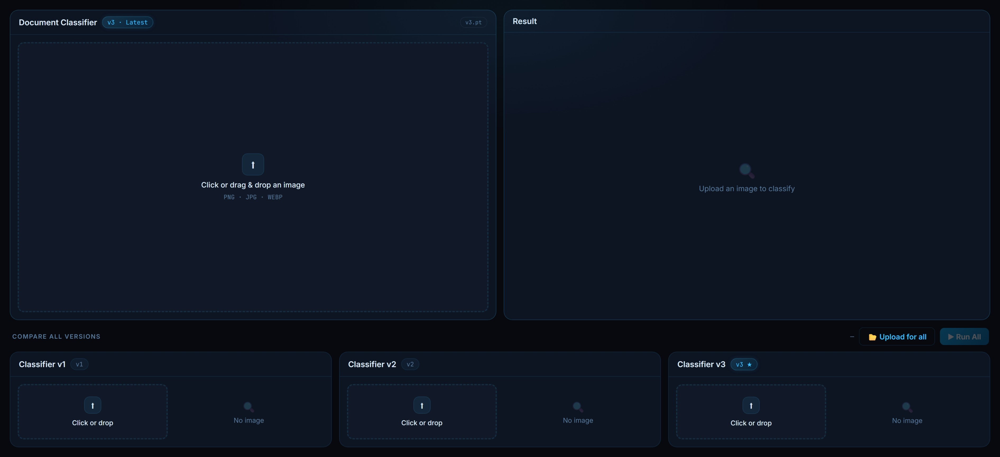
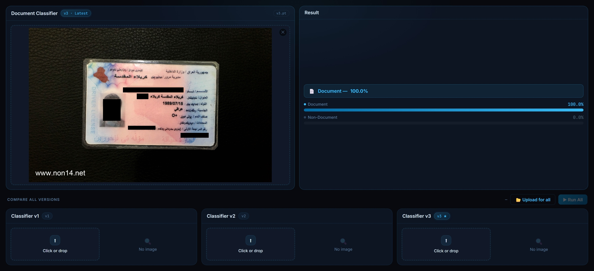
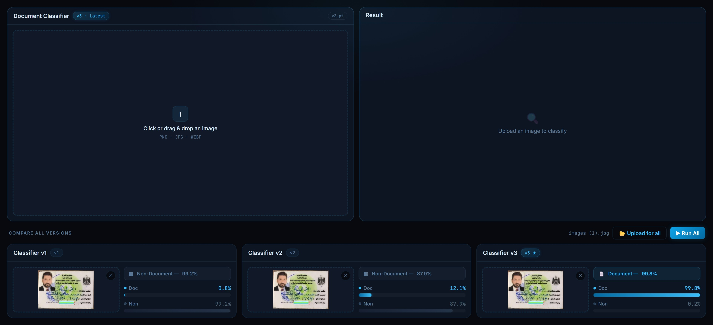

# Document Classifier

A binary image classification model that detects whether an image contains a document

## Features

- Detects a document in various conditions
- Scanned, photo, rotated, etc. all work
- Three different stages for training with V3 being the most solid
- A function 'predict_doc' is ready for use directly in any API endpoint by importing
- A simple web UI and server code just to demonstrate the models

## Tech Stack

- Python
- Ultralytics
- YOLO
- yolov8l-cls.pt
- HTML, CSS, and JS

## Training Data

- MIDV-2020 dataset containing over 3000 document images in different conditions (Thanks to Asst. Prof. Ming Zuheng and University of La Rochelle)
- Random non-document images from Kaggle containing 5000 images
- Plus some more documents that I added manually for futher finetuning (perfectly cut-out documents and handwritten documents like the Iraqi residance card)

## Models

- document_classifier_v1: First training, lacks the ability to detect perfectly cut-out document images
- document_classifier_v2: Detects well, lacks the ability to detect handwritten documents (like the Iraqi residance card)
- document_classifier_v3: Lateset and best model, detects all kinds of documents

## Screenshots

<p align="center">
  
  
</p>

<p align="center">
  
  
</p>

## Setup & Usage

- Clone the repo
- Create '.venv' by 'python -m venv .venv'
- Activate it by '.venv/scripts/activate.ps1' (Powershell)
- Install dependencies with 'pip install -r requirements.txt --extra-index-url https://download.pytorch.org/whl/cu118'
- Run the 'server.py' script with 'python server.py' for the demonstration webpage
- Import 'predict_doc' wherever you like to use or take the model and use it where you need (Pay attention to dependencies)

## Structure

```batch
├── models
│   ├── document_classifier_v1.pt
│   ├── document_classifier_v2.pt
│   ├── document_classifier_v3.pt
├── preprocessing
│   ├── crop.py
│   ├── flatten.py
│   ├── rename.py
│   ├── shuffle.py
│   ├── split.py
├── testing
│   ├── test.py
│   ├── test_bulk.py
├── train
│   ├── finetune.py
│   ├── train.py
├── training_dataset
│   ├── train
│   │   ├── document
│   │   ├── nondocument
│   ├── val
│   │   ├── document
│   │   ├── nondocument
├── yolo
│   ├── yolov8l-cls.pt
├── .gitattributes
├── .gitignore
├── document-classifier.html
├── predict_doc.py
├── README.md
├── requirements.txt
├── server.py
```

## Author

H2SO4-1191 – Software Engineer
